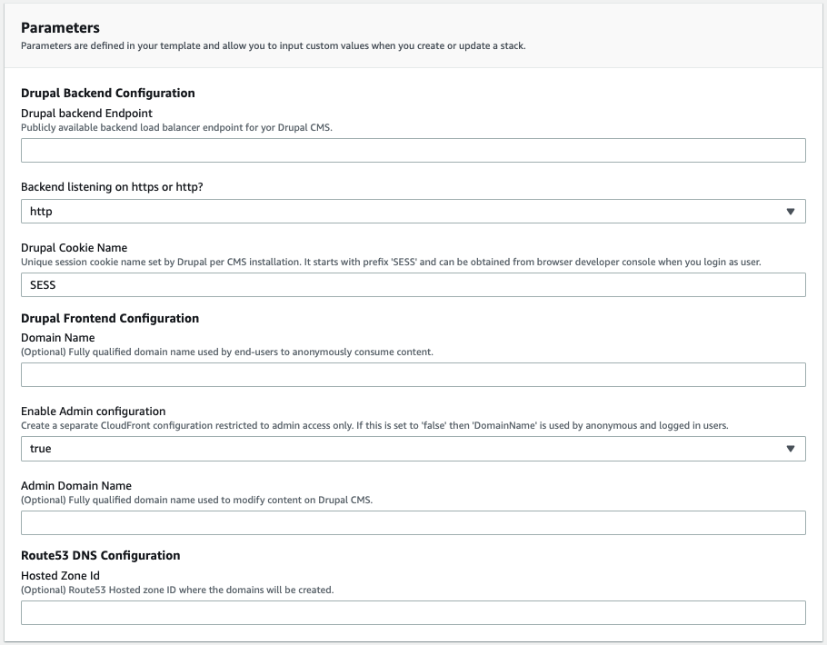
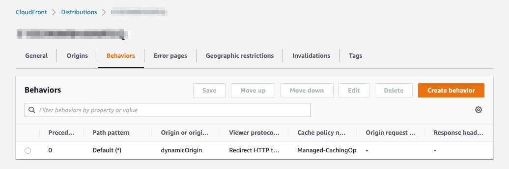
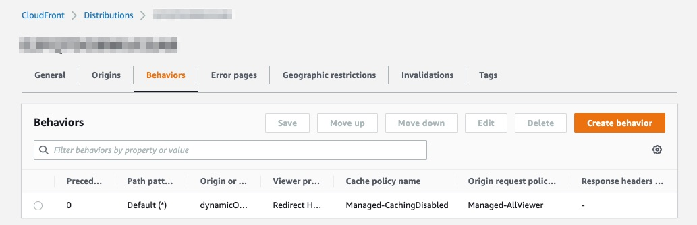

# Secure and Accelerate Drupal CMS with Amazon CloudFront

Best practices on setting up Drupal with Amazon CloudFront, AWS WAF, CloudFront Functions to serve both anonymous viewers and admin users.

## Deployment

Before getting started, you will need a Drupal powered backend listening on a publicly available endpoint. If you don’t have a setup then you can use the following AWS Quick Start (https://aws.amazon.com/quickstart/architecture/drupal/) solution which follows the best practices in setting up the Drupal. (Note this solution optionally allows you to configure CloudFront to serve viewers).

Once you have the Drupal backend available, clone the GitHub repo here (https://github.com/aws-samples/amazon-cloudfront-secure-accelerate-drupal) and deploy the CloudFormation template available under ‘templates/drupal-cf.yml’. Note the deployment needs to be in *‘us-east-1*’ AWS region.

### Walk through of the CloudFormation template input parameters:

The CloudFormation template defines the AWS resources and provides parameters to configure your setup matching either of the scenarios discussed earlier. When you start the deployment, enter a ‘Stack Name’ and then you will be presented with a set of configuration parameters. Let’s understand what they imply.


*Drupal Backend Configuration*

* *Drupal backend Endpoint* - this is the publicly available domain name pointing to your current Drupal installation. Note this domain name needs to be different from the one serving your viewers.
* *Backend listening on https or http?* - select ‘https’ if your origin is listening for TLS connections.
* *Drupal Cookie Name* - we will leave it to default value of ‘SESS’ and update it post deployment. Refer section ‘Note on Drupal Session Cookie’ for more details.

*Drupal Frontend Configuration*

* *DomainName* (optional) - specify the domain name used by viewers to connect to your website. This domain name will be mapped to the CloudFront distribution to serve the viewer traffic. If this is left blank then you can still serve the traffic with default CloudFront domain name created, the format will be dxxxxx.cloudfront.net (http://dxxxxx.cloudfront.net/)
* *AdminConfig* - select ‘yes’ if you want separate configurations (scenario 1) created to cater to viewers and admin users. If you select ‘no’ then a single CloudFront distribution and WAF configuration (scenario 2) is created.
* *AdminDomainName* (optional)- specify the second domain name used by admin users to manage content updates to the Drupal CMS. This domain name will be mapped to a second CloudFront distribution if created (depends on value of AdminConfig parameter). If this is left blank then you can still serve with default CloudFront domain name created.

Note that when either or both of ‘DomainName’ and ‘AdminDomainName’ are specified as alternate domain name to your CloudFront distribution, you must attach a trusted TLS certificate that validates your authorization to use the domain name. This deployment creates the necessary certificates using AWS Certificate Manager (https://aws.amazon.com/certificate-manager/) for these domains and uses  (https://docs.aws.amazon.com/acm/latest/userguide/dns-validation.html)DNS based validation (https://docs.aws.amazon.com/acm/latest/userguide/dns-validation.html) to authorize ownership of the domain.

*Route53 DNS Configuration*

* *HostedZoneId* *-* is used to create the ‘Domain Name’ and ‘Admin Domain Name’ records in your Amazon Route 53 (https://aws.amazon.com/route53/) hosted zone. This field is required if either or both domain names are specified.

Once you specify these parameters, proceed to deploy the CloudFormation template. After the deployment is complete the AWS resources created depends on the input parameters specified during deployment.

If *‘Enable Admin configuration’* is set to *‘yes’* (caters to scenario 1) then you will have two CloudFront distributions and each of these distribution is associated with its own AWS WAF configurations. The corresponding distribution’s  *‘description’* field specifies if its being configured for viewers or for admin users.

The CloudFront distribution with description *‘StackName-viewer distribution for Drupal content delivery’* is used to serve traffic to your end viewers. This distribution has a single default behavior pointing to your *‘Drupal backend Endpoint’* as shown below.



This cache behavior is defined to optimize for caching content (using the ‘Managed-CachingOptimized (https://docs.aws.amazon.com/AmazonCloudFront/latest/DeveloperGuide/using-managed-cache-policies.html#managed-cache-policies-list)’ cache policy’).  Depending on the ‘Cache-Control’ headers sent from origin the content is cached with a minimum time to live (TTL) of 1 sec, a maximum TTL of 31536000 sec (365 days) and a default TTL of 86400 sec (1 day) when no cache-control header is specified. To learn more on how CloudFront honors cache-control headers refer https://docs.aws.amazon.com/AmazonCloudFront/latest/DeveloperGuide/Expiration.html

The associated AWS WAF configuration (https://console.aws.amazon.com/wafv2/homev2/web-acls?region=global) with name *‘StackName-ViewerWAFWebACL’* blocks all ‘admin’ access URLs using a regex match rule. A regular expression rule set with name *‘StackName-DrupalAdminRegex’* is created and it defines the path patterns for ‘admin’ URLs as shown. Update this regex rule group to include additional URL patterns that need to be restricted.

```
^(\/user\/|\/admin\/)
^(\/node\/|\/batch|\/core\/)
```

A second CloudFront distribution with description *‘StackName-Admin distribution for Drupal content updates’* is used by admin users to manage content updates. This distribution has a single default behavior whose origin maps to the ‘Drupal backend Endpoint’ and is set to not cache content (using the ‘Managed-CacheDisabled (https://docs.aws.amazon.com/AmazonCloudFront/latest/DeveloperGuide/using-managed-cache-policies.html#managed-cache-policies-list)’ cache policy).



The configuration passes all viewer headers, query strings and cookies (using the ‘Managed-AllViewer (https://docs.aws.amazon.com/AmazonCloudFront/latest/DeveloperGuide/using-managed-origin-request-policies.html#managed-origin-request-policies-list)’ origin request policy) so that content updates are reflected immediately to admin users.

The associated WAF configuration name ‘*StackName-AdminWAFWebACL’* blocks all anonymous (when the drupal session cookie is not set) access to admin URLs except the login page.

Additionally, if you have specified domain names using the ‘Domain Name’ and ‘Admin Domain Name’ field, they are associated to the corresponding CloudFront distributions along with the ACM certificates. Route53 record sets are also placed allowing you to serve traffic over HTTPS using the alternate domain names.

If *‘Enable Admin configuration’* is set to *‘no’* (caters to scenario 2), the CloudFormation template will deploy a single CloudFront distribution and WAF configuration. In this configuration, the CloudFront distribution will have explicit cache behavior to identify ‘admin’ URL patterns for which caching is disabled and the default cache behavior caters to all article pages. The default behavior is also associated with a ‘Viewer-Request’ CloudFront function which randomized a query parameter for logged-in users to ensure updates to content is immediately visible as explained earlier in section ‘*Usage of the CloudFront function’.*

*Note on Drupal Session Cookie*
In the initial deployment we left the ‘Drupal Cookie Name’ input parameter to its default value of ‘SESS’ which is the default prefix Drupal uses for session cookies. We left it unchanged during the deployment because Drupal sets a unique cookie name for each host domain it serves and the actual name is available once we start serving through CloudFront using custom domain name.
So, once the deployment is complete, we access the admin sections of the CMS and use the developer tools of the browser to identify the actual cookie name which starts with ‘SESS’. We will use this value to redeploy the same template, this time just updating the ‘Drupal Cookie Name’ field with the new value. This will update the WAF configurations, cache policy and CloudFront function code to use the new values.

## Security

See [CONTRIBUTING](CONTRIBUTING.md#security-issue-notifications) for more information.

## License

This library is licensed under the MIT-0 License. See the LICENSE file.
